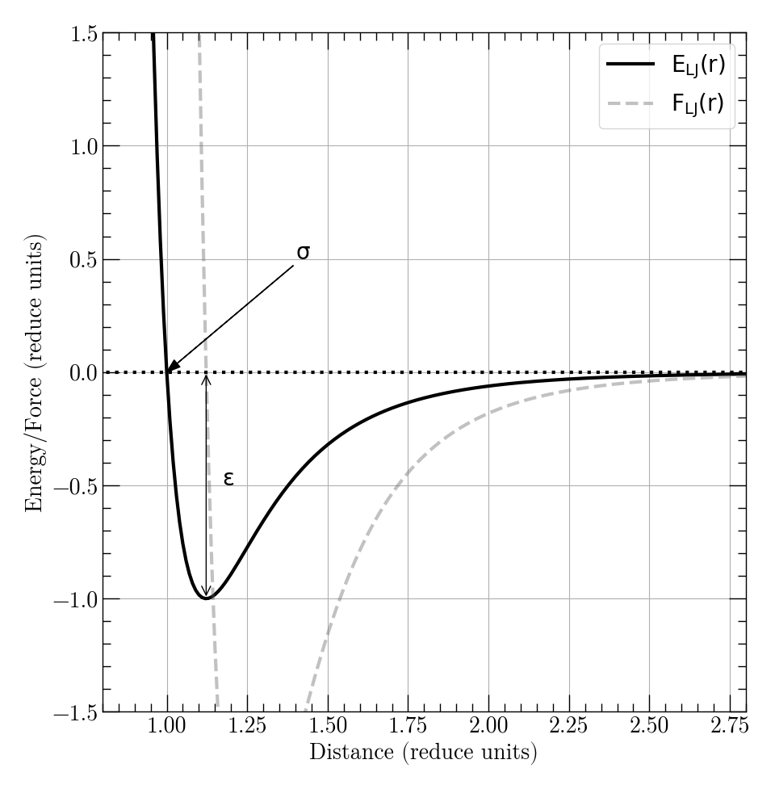

=================================
Setting up your first simulations
=================================

In this section we will modify the input from the previous section to
integrate the equations of motion of the atoms and have a first look at
the use of variables and computes in LAMMPS.

Defining non-bonded interactions
********************************

Let's have a look at the script we used in the first part: the `in.lmp` file.

.. code-block:: LAMMPS

   lattice sc 1.
   region box block 0 5 0 5 0 5
   create_box 1 box
   create_atoms 1 box

   mass 1 1

   write_data data.lmp
   write_dump all atom dump.lammpstrj

What this script does is:

1. defining a `lattice`, which is simply a set of positions, here all the
   combinations of {x,y,z} where each are multiples of 1.
2. defining an abstract region containing 5 lattice cells in each direction
   and putting atoms at those positions. Since there is only one atomic
   position per cell this results in :math:`5^3=125` atoms.
3. defining a concrete simulation box from this region.
4. putting atoms at the coordinates defined by the lattice.
5. giving them a mass, and writing output files.

That's it. Nowhere are interaction between atoms defined. As such they do not
interact with one another. Let's change that.

Edit the `in.lmp` file by adding the following lines between the `mass` and
`write_data` commands:

.. code-block:: LAMMPS

   ...
   mass 1 1

   pair_style lj/cut 2.5
   pair_coeff 1 1 1 1

   write_data data.lmp
   ...

If you save this file and execute the script using LAMMPS, you might think that
nothing changed, but if you open the data file, you'll notice that a new section
appeared: `Pair Coeffs # lj/cut`. The comment following the `#` symbol indicates
which pair style was used when defining the non-bonded interactions in the system.
A line starting with `#` is only indicative and will not be read by LAMMPS.
However, it will tell you which pair style you should set before reading the
said file. Here `lj/cut_` is the standard Lennard-Jones potential using a
cutoff distance. Pair of atoms separated by a distance longer than the cutoff
will not interact.

The definition of the interaction happens in two steps. First you set an
interaction style (here a `pair_style`). You then have to define interaction
coefficients for each type of atom. Note that the second step must be done
**after** the number of `atom types` is defined in the simulation.

It is worth detailing the format of the `pair_coeff` command. It defines
long range interactions between atoms with regard to their types. That is the
reason there are four values after the command: two for the types of interacting
pairs, two for the interaction coefficients. Here we only have atoms of type 1
so all the values are the same. If atoms of type 2 were present, we would have
had to add at least:

.. code-block:: LAMMPS

   pair_coeff 2 2 1 1

where 1 1 can be any other parameters we would like to use for type 2.

.. warning::

   Some interactions like `lj/cut` have default mixing rules that save some
   typing when defining cross-types interactions. Others might need specific
   format for the `pair_coeff` commands. In any case you should be aware that
   these mixing rules are euristics for simple models and that they do not
   apply to all long-range_interactions. We refer you to the manual's sections
   detailing the models you want to use for your simulations.

Energy minimization
*******************

Now that we have defined interactions between our atoms, we can compute forces
and energy for our system. In the general case, initial geometries are guesses
from chemical information from *real* systems, but they're not necessary
representative of equilibrium state of the model with the interactions you
are using. You can end-up in a situation where local structure cause force
divergence and numerical integration becomes unstable. Bad initial geometry
is a common problem that many people encounter without realizing.

If you are unsure about the situation, it is good practice to minimize the
energy of your system. Fortunately, LAMMPS allows you to do so. In short, it
makes atoms slowly go along their energy gradients. By default, the `minimize
<https://docs.lammps.org/minimize.html>`_ command uses conjugate gradients
algorithm to this end.

You can add the following line in your `in.lmp` file.

.. code-block:: LAMMPS

   ...
   minimize 1e-6 1e-8 1000 2000
   write_data data.lmp
   ...

What this command means is "try to minimize the energy of the system 1000 times
*or* until the energy difference between consecutive steps is less than 1
millionth in energy units *or* until the relative force difference is less than
100 millionth *or* it takes more than 2000 evaluation to converge in energy and
forces". In the case of our Lennard-Jones simple crystal, this should be rather
straight forward since we are already close to an energy minimum.

.. _lj/cut: https://docs.lammps.org/pair_lj.html
